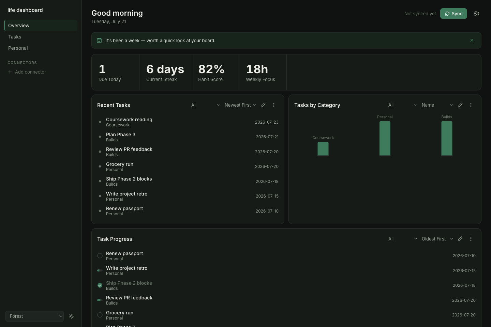

# life dashboard

A personal dashboard where every block is generic and can be pointed at
anything — your own tasks and metrics, or a connected external service —
without a bespoke UI per source. $0 to run: every service is resolved
through a small hand-written adapter calling that service's own free
API directly, never an LLM in the sync path.

Full spec lives in `CLAUDE.md` and `docs/`. This file is orientation
plus how to actually use it day to day.



## What it is

A block is a display shape. A source is where its data comes from. The
two are independent — any block type can read from your own local
tasks/metrics, or from a connected service, and the block component
never knows or cares which. That's what makes "point any block at
anything" true without a bespoke UI per integration.

**Local sources** read straight from your own `tasks` and `metrics`,
stored in the browser, no network call, always current.

**Connected-service sources** go through a small hand-written adapter
(`server/adapters/`) instead of a bespoke UI per integration. A
connector just proves a service is in use — the credential lives once
in `.env`, never in the browser. What to actually fetch is a per-block
choice: pick one of that service's **capabilities** (e.g. GitHub's
`commit-heatmap` or `recent-commits`), then fill in that capability's
own params (a username, say). One connector can back many
differently-configured blocks.

## Block types

Twelve display shapes, each usable with either source kind (`text`,
`links`, and `embed` are local-only, they hold content directly):

| Type | Shape |
|---|---|
| `stat` | One big number and a label |
| `stat-grid` | Several stats side by side |
| `list` | Title/subtitle/date rows |
| `progress-list` | Same as `list`, but each row has a `percent` — renders as a checkbox at 0%/100%, a bar in between |
| `table` | Multi-column rows |
| `chart` | Simple bar chart |
| `breakdown` | A ring with a total in the middle and colored segments around it — task progress, focus time, a habit score |
| `heatmap` | GitHub-style day-by-day intensity grid — coding activity, a habit streak, anything that's a count per day |
| `week` | Seven day-columns with a short entry list each — calendar events, or tasks due this week |
| `text` | One plain textarea, no rich formatting |
| `links` | A small bookmark organizer grouped by category, with its own add form |
| `embed` | A curated embed for one allowlisted provider (YouTube, Google Sheets, Figma, Loom) |

## Quick start

```
npm install
cp .env.example .env        # add a token per service you connect, e.g. GITHUB_TOKEN
npm run dev                 # frontend, http://localhost:5173
npm run server               # backend, http://localhost:3001
```

Both need to be running — the frontend calls the local backend, the
backend calls each connected service directly. No key ever ships to
the browser, and nothing here costs money to run. On first run the
board seeds itself with sample tasks, metrics, and links so it isn't
empty.

## Using it

**Add a block** — the dashed "+ Add Block" tile at the end of the
board. Three steps: pick a type, pick a source, name it. Editing an
existing block reopens the same panel (kebab menu → Edit block);
changing a block's type isn't supported, delete and recreate instead.

**Reorder, resize, delete** — every block's own kebab menu (⋮). Move
up/down swaps position; width is Half or Full, never a custom size or
height — height always follows content.

**Filter the board** — the sidebar is a category filter over the one
board, not a router. Give a block a category in step 3 of the editor
and a matching sidebar chip appears automatically; click it to filter,
click Overview to clear. A fresh board has no chips beyond Overview —
they only show up once you've actually tagged something.

**Hero band** — on Overview, `stat` and `stat-grid` blocks promote into
a big-number strip above the rest of the board instead of rendering as
regular cards, so the numbers you check most land first. Filter to a
category and they drop back into the grid like every other type.

**Sync** — the header's Sync button resolves every connected-service
block in one batched request. A block that fails keeps its last-known
data with a small stale indicator rather than going blank.

**Backup** — the header's download/upload icons export the whole board
(blocks, groups, tasks, metrics, settings) to one JSON file, and
restore from one. Restoring asks for confirmation first and replaces
everything currently on the board, so export a fresh copy before you
import an old one.

### Connecting GitHub

1. Generate a free personal access token at
   [github.com/settings/tokens](https://github.com/settings/tokens) —
   no special scopes needed for public contribution/commit data.
2. Add it to `.env` as `GITHUB_TOKEN`, then restart `npm run server`.
3. Settings (gear icon) → Connectors → add one, service "GitHub". It'll
   show connected/missing status live against the token you just set.
4. Add or edit a `heatmap` block (or a `list` block) → Connected
   service → pick the connector → pick a capability
   (`commit-heatmap` for heatmap blocks, `recent-commits` for list
   blocks) → enter the GitHub username to pull from.
5. Click Sync.

### Connecting Weather

No API key, no `.env` entry — Open-Meteo's geocoding and forecast
endpoints are both free and unauthenticated. Settings → Connectors →
add one, service "Weather" — it shows connected immediately. Add or
edit a `stat-grid` block → Connected service → pick the connector →
`current-weather` (or a `table` block → `forecast`) → enter a city
name. Click Sync.

### Connecting Google Calendar

The only connector that needs a real OAuth2 setup rather than a pasted
token, since reading a calendar needs a consent grant:

1. In [Google Cloud Console](https://console.cloud.google.com), create
   (or reuse) a project, enable the Google Calendar API, then
   Credentials → Create OAuth client ID → Web application. Add
   `http://localhost:3001/api/auth/google/callback` as an authorized
   redirect URI.
2. Add the client ID and secret to `.env` as `GOOGLE_CLIENT_ID` and
   `GOOGLE_CLIENT_SECRET`, then restart `npm run server`. Leave
   `GOOGLE_REFRESH_TOKEN` blank — the app writes it in for you.
3. Settings → Connectors → add one, service "Google Calendar" — it'll
   show "Missing token" with a **Connect with Google** button. Click
   it, sign in, grant calendar access; you'll land back on the board
   and the connector now shows Connected.
4. Add or edit a `list` block (`upcoming-events`) or a `week` block
   (`this-week`) → Connected service → pick the connector → pick the
   capability. Neither takes any params — it's always your primary
   calendar.
5. Click Sync.

Adding another service later means writing one more adapter file in
`server/adapters/` — see `docs/ARCHITECTURE.md`'s Source kinds section.

## Customizing

**Theme** — Settings → Theme, or the sidebar's compact switcher. Four
named presets (Forest, Slate, Plum, Charcoal), each with light and dark
variants, plus a custom accent color override that re-derives its
tint/strong shades automatically.

**Display name** — used in the header's time-of-day greeting ("Good
evening, Rushil"); falls back to just the greeting with no name if
blank.

**Weekly review nudge** — a dismissible banner appears above the board
once 7 days have passed since you last dismissed it, a light "worth a
quick look at your board" reminder, not a status warning.

## How it's built

- Frontend: Vite, React, TypeScript, plain CSS (no Tailwind, no CSS-in-JS)
- Backend: minimal Express server, holds every connected service's
  credential (`server/adapters/`) so no key ever reaches the browser
- Storage: browser `localStorage`, no database, single user, single
  machine

No drag-to-position, no freeform resize, no custom-code/iframe block
type, no router — these were cut on purpose, see `CLAUDE.md`'s
Non-negotiables before proposing to add them back.

## Docs

- `docs/ARCHITECTURE.md` — how blocks, sources, connectors, and sync fit together
- `docs/DATA_MODEL.md` — exact schemas and storage keys
- `docs/DESIGN.md` — palette, type, component styles, states
- `docs/ROADMAP.md` — build phases and what actually shipped in each
